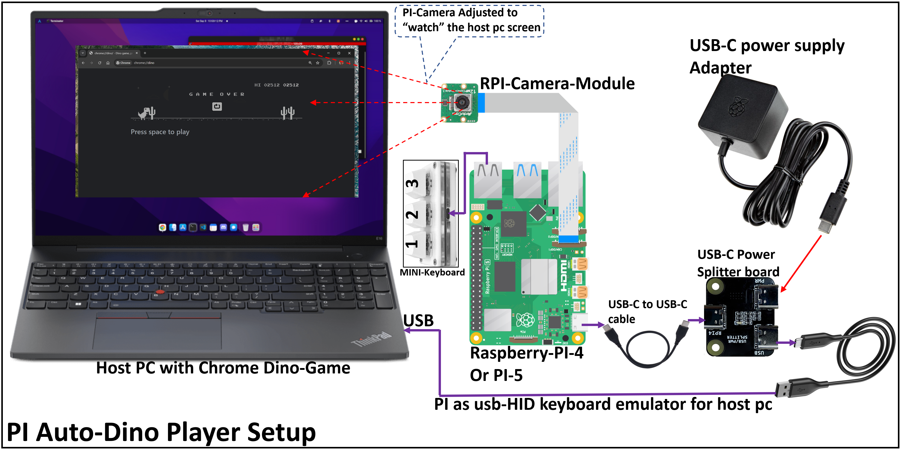
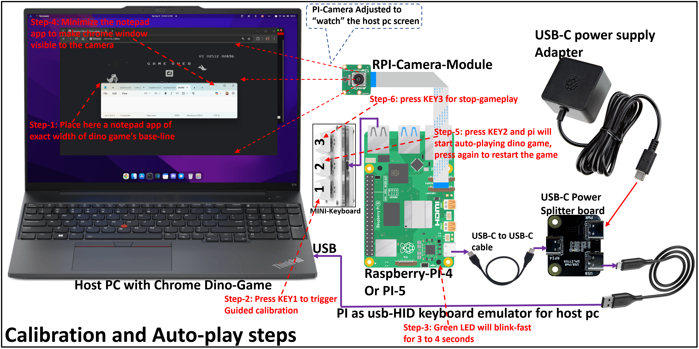

# gameplayer-bot

A Raspberry Pi that watches your screen with a camera, detects game state using OpenCV, and plays the game by physically typing keys via USB HID — no software on the host PC, no cloud, no neural networks. Just a camera, a USB cable, and some old-fashioned computer vision.

Currently plays **Chrome Dino** (scores 800–2500), with a plugin architecture ready for other games.

> [!IMPORTANT]
> **Current status:** Chrome Dino only. Additional game plugins (e.g. Breakout/Pong) are planned but not yet implemented.

> [!NOTE]
> This is the V2 evolution of the [ATtiny85-based Chrome Dino player](https://github.com/hackboxguy/chrome-dinoplayer)
> ([blog post](https://prolinix.com/blog/chrome-dino-auto-player/)), which used
> LDR light sensors and a simple brightness threshold. V2 replaces the sensors
> with a camera and OpenCV, enabling day/night mode handling, pterodactyl
> detection, and support for multiple games via swappable plugins.

<!-- TODO: replace with actual demo GIF/video -->
<!--
## Demo


-->

## Hardware Setup



| Component | Notes |
|---|---|
| Raspberry Pi 4 or 5 | USB gadget mode via dwc2 (USB-C port) |
| RPi Camera Module (CSI) | v1 (ov5647) or v2/v3; connected via ribbon cable |
| USB-C power splitter board | Splits USB-C into power + data (Pi 4/5 need separate power) |
| USB-C power supply | 5V/3A adapter |
| USB-C to USB-C cable | Data connection to host PC |
| 3-key mini USB keyboard | Optional — for headless operation without SSH |

The Pi's USB-C port operates in gadget (peripheral) mode. The host PC sees it as a standard USB keyboard + mouse. The camera watches the screen, OpenCV detects obstacles, and the Pi "types" jump/duck commands over USB.

**No drivers, no browser extensions, no software installed on the host PC.**

## Quick Start

### 1. Flash Raspberry Pi OS

Use [Raspberry Pi Imager](https://www.raspberrypi.com/software/) to flash **Raspberry Pi OS Lite (64-bit)** (Bookworm or Trixie). In advanced settings:
- Enable SSH
- Set username/password
- Configure WiFi (for initial SSH access)

### 2. Clone and Install

```bash
ssh pi@<your-pi-hostname>.local

git clone https://github.com/hackboxguy/gameplayer-bot.git
cd gameplayer-bot
sudo ./setup.sh
```

**Reboot** after setup (required for USB gadget mode):
```bash
sudo reboot
```

### 3. Verify HID Gadget

After reboot, check that the USB HID devices were created:
```bash
ls -la /dev/hidg*
# Should show /dev/hidg0 (keyboard) and /dev/hidg1 (mouse)
```

Test HID output (no camera needed):
```bash
sudo python3 src/main.py --test-hid
```
Open a text editor on the host PC — you should see spacebar presses.

### 4. Calibrate and Play



**Step 1:** Open Chrome Dino (`chrome://dino`) on the host PC. Place a white Notepad window sized to match the game's baseline width, positioned over the game area.

**Step 2:** Run guided ROI calibration:
```bash
sudo python3 src/main.py --guided-roi --camera csi
```

**Step 3:** Close Notepad, then start playing:
```bash
sudo python3 src/main.py --camera csi
```

The Pi sends a spacebar press to start the game, then plays automatically.

## Hotkey Operation (Headless)

With a 3-key USB mini keyboard plugged into the Pi, you can operate without SSH:

| Key | Action | LED Feedback |
|---|---|---|
| KEY_1 | Calibrate ROI | Green LED blinks during calibration |
| KEY_2 | Start / restart game | — |
| KEY_3 | Stop game player | LED restored to SD activity |

**Typical workflow:**
1. Place white Notepad over game baseline on host PC
2. Press **KEY_1** — Pi blinks LED while calibrating
3. Remove Notepad, open Chrome Dino game
4. Press **KEY_2** — Pi starts auto-playing (sends spacebar + begins detection)
5. After game-over, press **KEY_2** again — restarts fresh
6. Press **KEY_3** — stops everything

## How It Works

```
  Camera (60fps)  →  OpenCV  →  Decision  →  USB HID Keyboard
  watches screen     frame       jump or      sends keystrokes
                     diffing     duck?        to host PC
```

### Detection Pipeline (~20ms end-to-end)

1. **Frame capture** — CSI camera at 60fps (640x480)
2. **Frame differencing** — `cv2.absdiff(current, previous)` cancels all static elements (ground, score, dino). Only moving obstacles produce signal.
3. **Speed measurement** — Phase correlation on ground texture measures scroll speed in px/frame. One-way ratchet (speed never drops mid-game).
4. **Adaptive scan strip** — Jump detection zone shifts further ahead at higher speeds (27% at start, 40% at max speed), giving more reaction time.
5. **Obstacle classification** — Vertical centroid of motion distinguishes cactuses (ground-level, centroid ~85%) from pterodactyls (floating, centroid <50%).
6. **Action** — Jump (spacebar) or duck (down arrow) sent via USB HID.

### Why Frame Differencing?

A camera watching a screen is fundamentally different from reading pixels directly. Camera noise, auto-exposure shifts, and screen refresh artifacts make static thresholding unreliable. Frame differencing elegantly cancels all of this — only moving objects produce signal.

## Use Cases Beyond Dino

- USB HID gadget validation for Raspberry Pi projects
- External-agent CV experiments for kiosk/air-gapped/locked-down hosts
- Latency benchmarking for camera → CV → HID control loops
- A reference implementation for plugin-based camera game automation

## Recommended Workflow

The easiest way to operate gameplayer-bot is with the **3-key USB keyboard** (hotkey flow described above). No SSH session needed — just plug in the keyboard and press buttons.

1. Connect the Pi to the host PC, power it on
2. Open Chrome Dino (`chrome://dino`) on the host PC
3. Place a white Notepad window over the game baseline
4. Press **KEY_1** to calibrate (LED blinks)
5. Remove Notepad, press **KEY_2** to play
6. Press **KEY_2** again after game-over to restart

### Auto-Start on Boot (Advanced)

For fully unattended operation, the Pi can auto-calibrate and play on boot.
This requires the Notepad window to be positioned **before** the Pi powers on,
since there is no manual calibration step.

```bash
sudo ./setup.sh --autostart
```

Boot sequence: Pi boots → detects Notepad (retries for up to 2 min) → calculates ROI → sends spacebar to start the game → plays automatically. Remove the Notepad after the LED stops blinking.

## Configuration

Edit `configs/game.ini` to tune camera settings and game parameters:

```ini
[general]
plugin = chrome-dino
camera_type = auto
camera_fps = 60        # 30 or 60 — speed constants auto-adapt

[roi]
# Set via --guided-roi or --auto-roi (no manual editing needed)
x1 = 140
y1 = 130
x2 = 530
y2 = 210
```

Speed constants are defined at a 30fps reference and automatically scale for any configured frame rate — changing `camera_fps` requires no code changes.

## CLI Reference

```bash
# Play (main game loop)
sudo python3 src/main.py --camera csi

# Calibrate ROI using white Notepad as guide
sudo python3 src/main.py --guided-roi --camera csi

# Auto-detect ROI (no Notepad needed, less reliable)
sudo python3 src/main.py --auto-roi --camera csi

# Test HID output (no camera needed)
sudo python3 src/main.py --test-hid

# Capture a frame for manual ROI setup
sudo python3 src/main.py --calibrate --camera csi

# Boot mode (auto-calibrate with retries, then play)
sudo python3 src/main.py --boot --camera csi
```

## Project Structure

```
gameplayer-bot/
├── setup.sh                          One-command setup (deps + gadget + hotkeys)
├── configs/
│   ├── game.ini                      Camera, ROI, and game tuning config
│   ├── setup-gadget.sh               USB HID composite gadget (keyboard + mouse)
│   ├── gameplayer-bot-gadget.service  systemd: create HID gadget at boot
│   ├── gameplayer-bot.service         systemd: run game player
│   └── gameplayer-bot.triggers        trigger-happy hotkey template
├── scripts/
│   ├── gp-calibrate.sh               KEY_1: guided ROI calibration
│   ├── gp-start.sh                   KEY_2: start/restart game player
│   └── gp-stop.sh                    KEY_3: stop game player
├── src/
│   ├── main.py                        Entry point and game loop
│   ├── camera.py                      picamera2 / OpenCV camera wrapper
│   ├── hid.py                         USB HID keyboard/mouse helpers
│   ├── config.py                      Config file loader
│   └── plugins/
│       ├── base.py                    GamePlugin base class
│       └── chrome_dino.py             Chrome Dino: jump/duck via frame differencing
└── images/                            Documentation images
```

## Adding New Games

The plugin architecture makes it straightforward to add new games. Each plugin implements:

```python
class MyGamePlugin(GamePlugin):
    name = "my-game"
    hid_type = "keyboard"  # or "mouse"

    def detect(self, frame) -> dict:
        # CV logic: analyze the ROI frame, return game state
        ...

    def decide(self, state) -> dict:
        # Strategy: given game state, decide what action to take
        ...

    def get_hid_report(self, action) -> bytes:
        # Convert action to USB HID report bytes
        ...
```

Set `plugin = my-game` in `configs/game.ini` and register it in `src/main.py`.

## V1 vs V2

| | V1 ([ATtiny85 + LDR](https://github.com/hackboxguy/chrome-dinoplayer)) | V2 (gameplayer-bot) |
|---|---|---|
| **Sensor** | 2x LDR light sensors on monitor | CSI camera on tripod |
| **Detection** | Brightness threshold (dark/light) | OpenCV frame differencing |
| **Day/night** | Fails (needs DevTools workaround) | Handled automatically |
| **Pterodactyl** | Cannot detect | Centroid-based classification |
| **Games** | Chrome Dino only | Any game (plugin architecture) |
| **HID output** | Keyboard only | Keyboard + mouse composite |
| **Cost** | ~$5 | ~$50 |
| **Score** | ~200-400 | 800-2500 |

## Limitations

- Only Chrome Dino is implemented; other game plugins are planned.
- Requires physical setup (camera aim, monitor position, ROI calibration).
- Camera-based detection is sensitive to reflections, motion blur, and lighting changes.
- Known edge case: day/night transition with an obstacle present can cause a miss.

## Acknowledgments

This project was built with AI assistance using [Claude Code](https://claude.ai/download) (Anthropic) and reviewed with [Codex](https://openai.com/index/introducing-codex/) (OpenAI). The detection algorithms, architecture decisions, and debugging were developed through iterative human-AI collaboration — the AI helped write code and solve problems, while all testing and validation was done on real hardware.

## License

[MIT](LICENSE)
